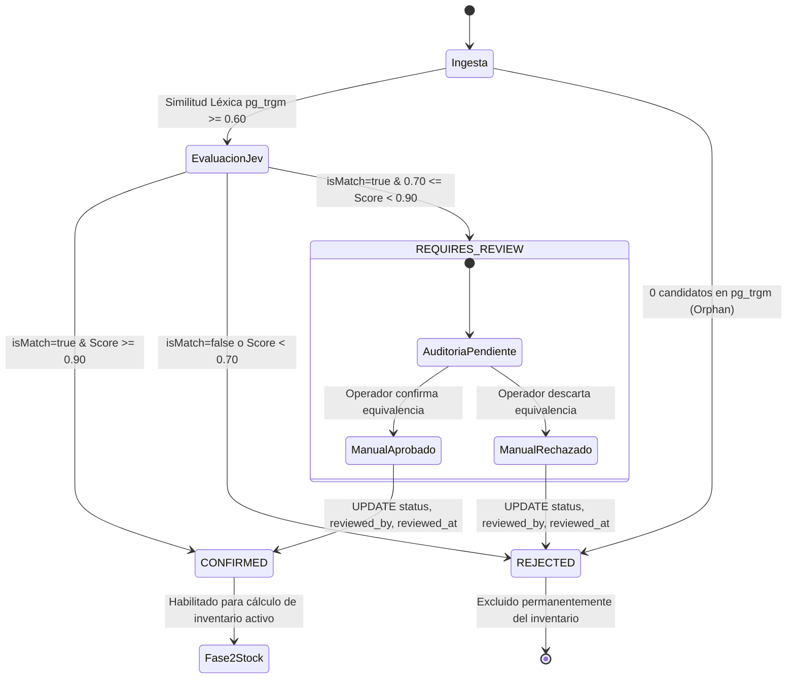

# Especificación Técnica: Flujo Operativo de Auditoría Human-in-the-Loop

**Identificador:** `SPEC-AUDIT-008`  
**Archivo de Destino:** `specs/08-human-in-the-loop-audit.spec.md`  
**Módulos Relacionados:** `src/product.repository.ts`, `src/types.ts`  
**Requerimientos SRS:** `RF-04`, `RF-07`  
**Estado:** `Aprobado`  

---

## 1. Propósito y Alcance

Esta especificación formaliza el ciclo de vida, la máquina de estados y las reglas de auditoría para aquellos productos cuya confianza de inferencia se sitúa en la franja ambigua ($0.70 \le \text{confidenceScore} < 0.90$), resultando en el estado `REQUIRES_REVIEW`.

Objetivos del módulo:
1. **Contención de Riesgo:** Evitar que coincidencias dudosas afecten automáticamente el inventario disponible en la Fase 2.
2. **Supervisión Humana Eficiente:** Proveer mecanismos para que operadores de catálogo revisen casos limítrofes y formalicen la relación comercial.
3. **Trazabilidad Inviolable:** Exigir la captura obligatoria de la identidad del auditor (`reviewed_by`) y la marca de tiempo de la decisión (`reviewed_at`).

---

## 2. Máquina de Estados del Mapeo



---

## 3. Reglas de Negocio y Transiciones

1. **Exclusión Temporal de Fase 2:**
   - Todo registro con estado `REQUIRES_REVIEW` es computado como `NO_CATALOGADO` en la consulta determinista de stock hasta que ocurra una intervención humana explícita.
2. **Atomicidad de Auditoría:**
   - La transición desde `REQUIRES_REVIEW` hacia `CONFIRMED` o `REJECTED` debe registrar indefectiblemente el usuario auditor (`reviewed_by`) y el momento exacto (`reviewed_at = CURRENT_TIMESTAMP`).
3. **Inmutabilidad Post-Resolución:**
   - Una vez que un registro pasa a `CONFIRMED` o `REJECTED` por intervención manual, no puede ser sobreescrito automáticamente por nuevas ejecuciones del worker automático, salvo re-conciliación manual forzada.

---

## 4. Contratos de Interfaz para Auditoría (`src/types.ts`)

```typescript
export interface AuditReviewPayload {
  clientSku: string;
  targetStatus: "CONFIRMED" | "REJECTED";
  reviewerEmail: string;
}

export interface IProductRepository {
  // Métodos de auditoría
  getPendingReviews(limit: number): Promise<MappingRecord[]>;
  resolveAuditReview(
    clientSku: string,
    status: "CONFIRMED" | "REJECTED",
    reviewer: string
  ): Promise<void>;
}
```

---

## 5. Criterios de Aceptación (BDD / Given-When-Then)

### Escenario 1: Aprobación manual de un mapeo dudoso
- **Given** un registro en `product_mappings` con `client_sku = 'CLI-PEND-01'`, `supplier_sku = 'SUP-VAR-01'` y `status = 'REQUIRES_REVIEW'`.
- **When** el operador invoca `resolveAuditReview('CLI-PEND-01', 'CONFIRMED', 'auditor@empresa.com')`.
- **Then** el registro se actualiza con `status = 'CONFIRMED'`, `reviewed_by = 'auditor@empresa.com'` y `reviewed_at` no nulo.
- **And** en la siguiente ejecución de Fase 2, el producto se incluye en el cálculo activo de inventario.

### Escenario 2: Rechazo manual de un candidato no equivalente
- **Given** un registro en `product_mappings` con `status = 'REQUIRES_REVIEW'`.
- **When** el operador determina que las especificaciones difieren y ejecuta `resolveAuditReview(..., 'REJECTED', 'auditor@empresa.com')`.
- **Then** el estado pasa a `REJECTED` y el producto permanece catalogado como no disponible en Fase 2.

### Escenario 3: Prevención de auditoría con identificador de auditor nulo o vacío
- **Given** una solicitud de revisión manual donde `reviewer` es una cadena vacía `""`.
- **When** se valida la operación antes de la mutación.
- **Then** el sistema rechaza la actualización con una excepción de validación, garantizando la trazabilidad regulatoria.
